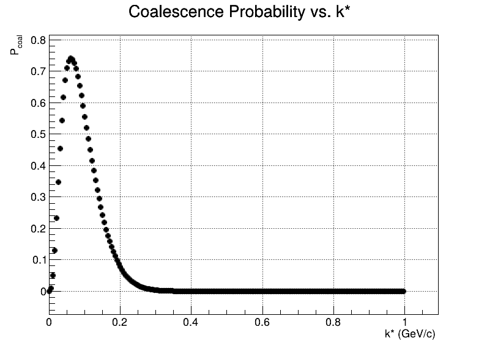
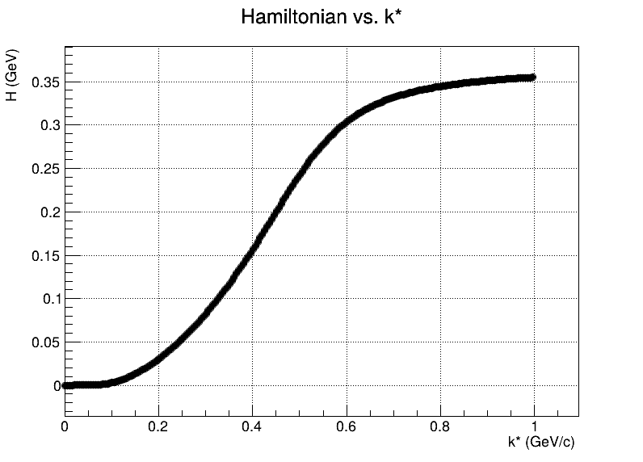
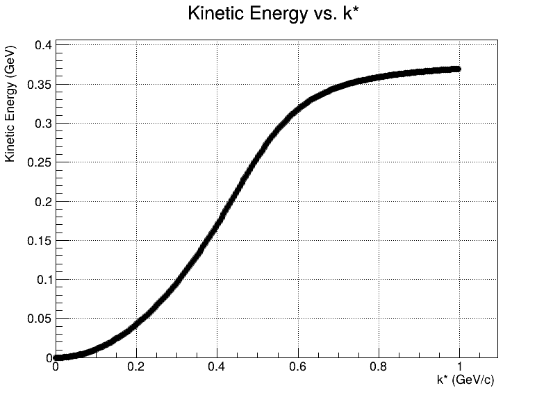
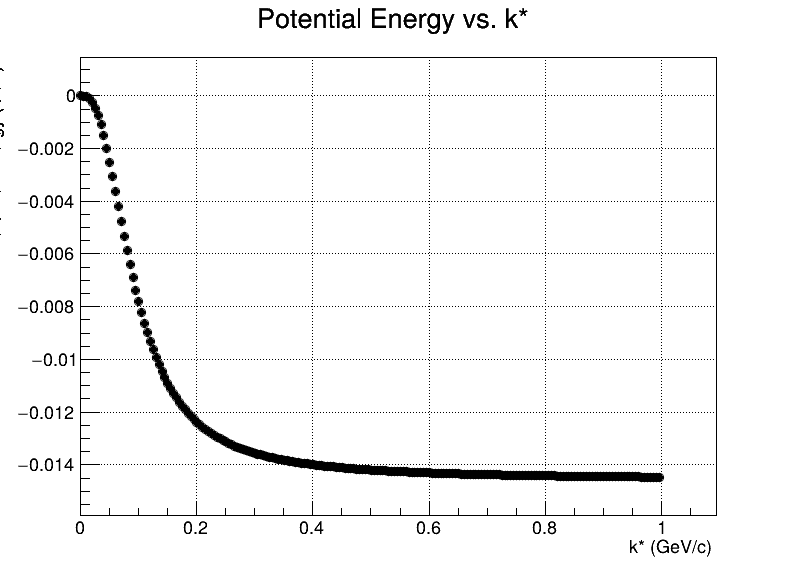

# WignerSource

**WignerSource** is a C++ module for computing and handling Wigner functions using the ROOT framework. It provides utilities for simulating quantum mechanical systems and visualizing phase space distributions.

---
## Table of Contents
- [Wigner Function Theory and Implementation](#wigner-function-theory-and-implementation)
  - [Wigner Function from a Gaussian Source](#wigner-function-from-a-gaussian-source)
  - [Energy Terms and Wigner-Weighted Integrals](#energy-terms-and-wigner-weighted-integrals)
    - [Kinetic Energy](#kinetic-energy)
    - [Potential Energy (Square-Well)](#potential-energy-square-well)
    - [Total Hamiltonian](#total-hamiltonian)
  - [Deuteron Coalescence Probability](#deuteron-coalescence-probability)
- [File Structure](#file-structure)
- [How the Code Works](#how-the-code-works)
  - [Wigner Function Initialization](#wigner-function-initialization)
  - [Parameter Management](#parameter-management)
  - [Numerical Integration](#numerical-integration)
  - [Observables Computed](#observables-computed)
  - [Simulation Workflow](#simulation-workflow)
  - [Plotting and Analysis](#plotting-and-analysis)
- [Example of Results](#example-of-results)
  - [Numerical Integration Accuracy](#numerical-integration-accuracy)
  - [Coalescence Probability vs. k*](#coalescence-probability-vs-k)
  - [Hamiltonian vs. k*](#hamiltonian-vs-k)
  - [Kinetic Energy vs. k*](#kinetic-energy-vs-k)
  - [Potential Energy vs. k*](#potential-energy-vs-k)
- [Documentation](#documentation)
  - [How to Generate the Documentation](#how-to-generate-the-documentation)
- [Requirements](#requirements)
- [How to Run](#how-to-run)
  - [Manual Installation](#manual-installation)
    - [Manual Run](#manual-run)
  - [Docker-Based Execution](#docker-based-execution)
    - [Dockerfile](#dockerfile)
    - [rundocker.sh](#rundockersh)
- [Other Usage](#other-usage)
  - [Example Usage](#example-usage)

---

## Wigner Function Theory and Implementation

This software models quantum coalescence using the Wigner function, which provides a phase-space distribution consistent with quantum mechanics, capturing both position and momentum information.

### Wigner Function from a Gaussian Source

The source is modeled as a 3D Gaussian wave packet modulated by a plane wave:

    φ(r) = A * exp( -r² / (8 * R₀²) ) * exp( i * k·r / ħ )

The corresponding Wigner function is:

    W(r, p) = (1 / (2πħ)³) * exp( -r² / (4 * R₀²) ) * exp( -4 * R₀² * (k + p/ħ)² )

This function is Gaussian in both r and p, centered around the classical values.

To obtain the radial momentum distribution, the function is integrated over angles assuming the momentum vector k is aligned along the z-axis:

    W(r, p) ∝ exp( -r² / (4 * R₀²) - 4 * R₀² * (k² + p²) / ħ² )
             * sinh( 8 * R₀² * k * p / ħ² ) / (8 * R₀² * k * p / ħ²)

---

### Energy Terms and Wigner-Weighted Integrals

This software evaluates energy observables of the source of intraction by integrating the Wigner source function weighted by classical energy terms.

#### Kinetic Energy

    T(p) = p² / (2 * μ)      where μ = pm[3]

The kinetic contribution is:

    W_K = ∬ T(p) * W_source(r, p) * J(r, p) dr dp

#### Potential Energy (Square-Well)

The potential is modeled as a square well of depth V₀ and radius R = pm[4]:

    V(r) = -V₀   if r < R
           0     otherwise

The potential energy contribution is:

    W_V = ∬ V(r) * W_source(r, p) * J(r, p) dr dp

#### Total Hamiltonian

The total energy is:

    H(r, p) = T(p) + V(r)

The Wigner-weighted total energy is:

    W_H = ∬ H(r, p) * W_source(r, p) * J(r, p) dr dp

These scalar integrals quantify the energy distribution of the quantum source in phase space.

---

### Deuteron Coalescence Probability

The coalescence probability represents the likelihood that a proton-neutron pair forms a deuteron. It is computed as the overlap of the source and deuteron Wigner functions:

    P_coal = ∬ W_source(r, p) * W_deuteron(r, p) * J(r, p) dr dp

Where:
- W_source(r, p) is the Gaussian source Wigner function
- W_deuteron(r, p) is provided via a ROOT file containing a precomputed 2D histogram from numerical integration of the deuteron wave function
- J(r, p) is the full spherical Jacobian including angular corrections:

    J(r, p) = (r * p)² * (4π)² * [ (1 - exp(-2α)) / (2α) ]

With:

    α = (8 * R₀² * k * p) / ħ²

This formulation incorporates both classical volume factors and quantum angular integration.

---
## File Structure

This project is organized into the following directories and key files:

- `include/` — Header files for the main classes:
  - `CWignerSource.h`: Wigner source class declaration
  - `CWignerUtils.h`: Static utility functions for Wigner operations

- `src/` — Implementation files:
  - `CWignerSource.cpp`: Implements the source class
  - `CWignerUtils.cpp`: Implements utility functions
  - `wigneroot.cpp`: Entry point for the ROOT-based interactive session

- `macros/` — ROOT macros:
  - `wignersim.cpp`: Runs Wigner simulations over a range of k*
  - `makeplots.cpp`: Generates plots from simulation results

- `config/` — Input configuration files:
  - `default.txt`: Default simulation parameters (e.g. radius, potential depth, integration range)

- `deuteronFunction/` — Deuteron Wigner function data:
  - `wigner2.root`: 2D histogram from numerical deuteron wavefunction integration

- `bin/` — Directory for compiled binaries (created after installation)

- `lib/` — Shared libraries produced by the build system

- `wignerenv.sh` — Script to set environment variables (`PATH`, `LD_LIBRARY_PATH`)

- `simulation.sh` — Bash script to launch multiple parallel simulation jobs and merge results

- `rundocker.sh` — Wrapper for executing simulations inside Docker

- `Dockerfile` — Docker image definition for building and running the environment

- `WignerLinkDef.h` — ROOT dictionary generation configuration

- `README.md` — Documentation and usage instructions (this file)
---
## How the Code Works

The core logic of **WignerSource** revolves around computing Wigner functions, performing numerical integrations over phase space, and evaluating observables like kinetic/potential energy and coalescence probability. Here's an overview of how the components interact:

### Wigner Function Initialization

- The central class is `wignerSource`, defined in `CWignerSource.h` and implemented in `CWignerSource.cpp`.
- The method `initFunctions()` initializes all relevant `TF2` objects (Wigner function, energies, coalescence probability, etc.).
- These functions are defined in terms of static callbacks from the `wignerUtils` class.

### Parameter Management

- Parameters like source radius (`R`), reduced mass (`μ`), potential width/depth (`Rwidth`, `V0`), and relative momentum (`k*`) are stored internally.
- You can set these via:
  - `setRadiusK(k)` — sets effective radius and momentum based on a physical `k*`
  - `SetFromTxt(filename)` — reads a full set of parameters from a text file (e.g., `default.txt`)

### Numerical Integration

Integration is handled via ROOT’s `TF2::Integral()` or manual grid integration (with small step sizes `dx`, `dp`).  
A Jacobian is applied to all observables to account for spherical coordinates.  
You can control integration limits using `setRanges()` or globally via `wignerUtils::setIntegrationRanges()`.

### Observables Computed

Once functions are initialized, the following quantities can be computed via `wignerSource` methods:

| Method         | Description                                      |
|----------------|--------------------------------------------------|
| `getwK()`      | Wigner-weighted kinetic energy                   |
| `getwV()`      | Wigner-weighted potential energy                 |
| `getwH()`      | Wigner-weighted Hamiltonian (T + V)              |
| `getcoal()`    | Deuteron coalescence probability                 |
| `checkWxW()`   | Normalization check of the Wigner function, good to check the consistency of the results, W x W = 1       |

These values are evaluated as 2D integrals over `r` and `p`, weighted by the Wigner function and Jacobian.

### Simulation Workflow

The macro `wignersim.cpp` scans over a range of `k*` values and stores:

- Source radius  
- Wigner normalization  
- Coalescence probability  
- Energy observables  

Results are saved to a `TTree` inside a ROOT file.

### Plotting and Analysis

The macro `makeplots.cpp` reads the simulation output and generates plots of:

- Coalescence probability vs. `k*`
- Kinetic, potential, and total energy vs. `k*`
- Kinetic, potential, and total energy vs. `r₀` (with a cut `0 ≤ r₀ ≤ 10 fm`)

Each plot is saved in both `.pdf` and `.root` format.

---
## Example of results

Here is an example of results produced by the simulation using the default parameters from `config/default.txt`:
```txt
1.0       # r0
0.469     # mu 
3.2       # rWidth
-0.0174   # v0
0.0       # Rmin
0.0       # Pmin 
20.0      # Rmax 
0.6       # Pmax
```

### Numerical Integration Accuracy

**Deuteron integral**: `0.999003`  
  This value indicates the accuracy of the numerical integration of the Wigner Deuteron function. A value of 1.0 represents perfect integration.


### Coalescence Probability vs. k*

The deuteron coalescence probability as a function of the relative momentum \( k^* \):



### Hamiltonian vs. k*

Total energy (Hamiltonian) of the interacting system as a function of \( k^* \):



### Kinetic Energy vs. k*

Kinetic energy contribution from the interaction source:



### Potential Energy vs. k*

Potential energy contribution from the interaction source:



---
## Documentation

This project supports source-level documentation using [Doxygen](https://www.doxygen.nl/), a widely-used tool for generating clean and navigable HTML (or LaTeX) documentation from annotated source code.

### How to Generate the Documentation

#### Install Doxygen

If Doxygen is not already installed:

- **Ubuntu/Debian**:  
  `sudo apt install doxygen`

- **macOS (Homebrew)**:  
  `brew install doxygen`

#### Generate the Documentation
After cloning the repository:
```bash
git clone https://github.com/ciavanick/WignerSource.git
cd WignerSource
```
To generate the HTML and LaTeX documentation, run the following command from the project root (`WignerSource`):  
`doxygen Doxyfile`

The `Doxyfile` is already configured. A `docs/` directory will be created with the following structure:

- `html/` — contains the full technical documentation in HTML format  
- `latex/` — contains LaTeX sources for the PDF reference manual

To view the HTML documentation:

- **Linux**:  
  `xdg-open docs/html/index.html`

- **macOS**:  
  `open docs/html/index.html`

To generate the PDF it needs to be manually compiled from LaTeX, e.g:

```bash
cd docs/latex
make
```
with for example pdflatex.
---
## Requirements

- [ROOT Framework](https://root.cern/)
- C++17 or higher
- `cmake`
- `make`
- `g++` (version ≥ 10 recommended)
- For Docker usage: Docker Engine installed

---
## How to run
There two way to compile/install and run the software:
- manual installation through cmake
- docker

### Manual installation
First of all ROOT needs to be installed and avaiable, to check:
```bash
root --version
```
this is necessary because `hadd` will be used.
After, clone the repository (if not already done):
```bash
git clone https://github.com/ciavanick/WignerSource.git
```
enter in the project folder
```bash
cd WignerSource
```
build and run the library:
```bash
mkdir build && cd build
cmake .. -DCMAKE_INSTALL_PREFIX=..
cmake --build .
cmake --install .
```
exit from the folder:
```bash
cd ..
```
#### Manual run
To manually run the code, in the project folder `WignerSource/`:
```bash
chmod +x simulation.sh
```
and then:
```bash
./simulation.sh <start> <end> <n_jobs> <increment> <output_folder> <file_prefix> [config_file]
```
where:
- `<start>` is the  starting `k*` value, 
- `<end>` is the last `k*` value, 
- `<n_jobs>` is the number of jobs, since the simulation runs on multi-jobs,
- ` <increment>` is the increment in `k*` of each cycle,  
- ` <output_folder>` is the output folder in which all the `.root` file and the pdf are saved,
- ` <file_prefix>` is the name of the file that will be created (the final final will be ` file_prefix_merged.root`),
- `[config_file]` input file with the configuration, if not given, the default is used.

the config file must be of the `config/default.txt` style.

**Example**:
```bash
./simulation.sh 0.001 2.0 8 0.005 simres res input.txt
```
or 
```bash
./simulation.sh 0.001 2.0 8 0.005 simres res
```

Note: input.txt must exist.

At the end of the simulation in the ` <output_folder>`, will be found:
- ` file_prefix_part_n.root`  where n is for every jobs created,
- ` file_prefix_merged.root` full tree with all the data from the simulation,
- ` coal_vs_k.root` and `coal_vs_k.pdf `, which is the coalescence probability as a function of k*
- `hamiltonian_vs_k.root` and `hamiltonian_vs_k.pdf`, which is the hamiltonian as a function of k*
- `hamiltonian_vs_r0.root` and `hamiltonian_vs_r0.pdf`, which is the hamiltonian as a function of r0
- `kinetic_vs_k.root` and `kinetic_vs_k.pdf`, which is the kinetic energy as a function of k*
- `kinetic_vs_r0.root` and `kinetic_vs_r0.pdf`, which is the kinetic energy as a function of r0
- `potential_vs_k.root` and `potential_vs_k.pdf`, which is the potential energy as a function of k*
- `potential_vs_r0.root` and `potential_vs_r0.pdf`, which is the potential energy as a function of r0

#### Recommendation 
Is recommended to run the simulation with as many jobs as possible.

### Docker-Based Execution
Is required to have Docker and bash.
#### `Dockerfile`
**Purpose**:  
Defines the build for a Docker image containing ROOT, GCC-12, and the Wigner simulation tools.

**How to build**:
```bash
docker build -t wignerutils .
```
#### `rundocker.sh`

**Purpose**:  
Wrapper for launching simulations inside a Docker container, with optional CPU, memory, and configuration bindings.

**Usage**:
```bash
chmod +x rundocker.sh
```
```bash
./rundocker.sh  <image_name> <start> <end> <n_jobs> <increment> <output_folder> <file_prefix> [cpus] [memory] [config_file]
```
where:
- `<image_name>` is the image name,
- `<start>` is the  starting `k*` value, 
- `<end>` is the last `k*` value, 
- `<n_jobs>` is the number of jobs, since the simulation runs on multi-jobs,
- ` <increment>` is the increment in `k*` of each cycle,  
- ` <output_folder>` is the output folder in which all the `.root` file and the pdf are saved in the docker environment,
- ` <file_prefix>` is the name of the file that will be created (the final final will be ` file_prefix_merged.root`),
- `[cpus]` number of cores to use, if not given, only 1 is used.
- `[memory]` memory avaiable, if not given, the default is used.
- `[config_file]` input file with the configuration, if not given, the default is used.

**Example**:
```bash
./rundocker.sh wignerutils 0.001 2.0 8 0.005 simres res 8 12g input.txt
```
or 
```bash
./rundocker.sh wignerutils 0.001 2.0 8 0.005 simres res 8 12g
```
The result are the same of `Manual run`, but now they are inside the folder `wigner_output`

#### Recommendation 
Is recommended to run the simulation with as many cores jobs and memory as possible.
Roughly on Docker runned on M1 machine with 8 cores and 12g of ram avaiable it needs around 10 minutes to fully simulate from a `k*` of 0.0001 to 1.0 with an increment of 0.005


## Other Usage

Since this project constitutes a **framework/library**, it is also possible to write your own macros—just like in ROOT—using the `wignerSource` and `wignerUtils` classes. These macros can then be run using the `wigneroot` interactive session.

### Example Usage

```bash
wigneroot macros.C
```

> **Note**: Before running the macro, you must source the environment setup script **each time** you open a new shell:

```bash
source wignerenv.sh
```


---